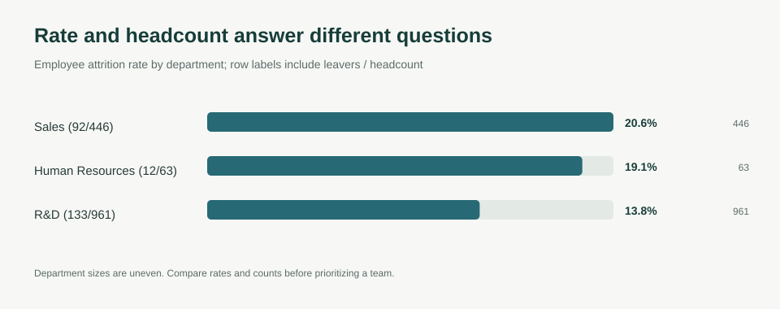
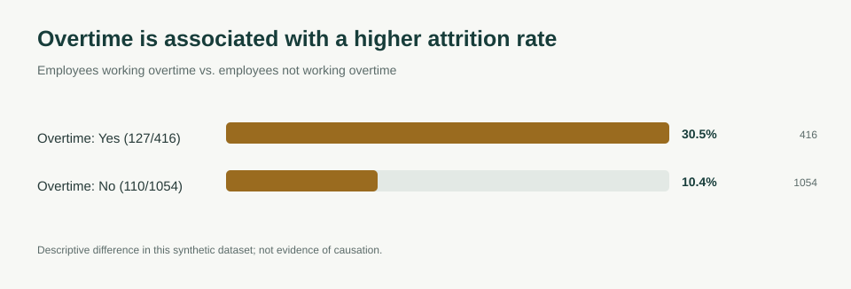
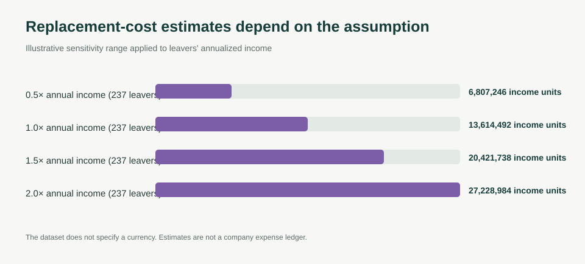

# Employee Attrition: Risk Is Not the Same as Volume

## The business question

If a people team wants to reduce attrition, should it focus on the department with the highest attrition rate, the department losing the most employees, or a workforce condition associated with leaving?

This case study uses IBM's synthetic HR analytics dataset to compare those views and show how cost estimates change when the replacement-cost assumption changes.

## Executive summary

- **237 of 1,470 employees left** in the dataset, an overall attrition rate of **16.1%**.
- Sales had the highest department rate (**20.6%, 92/446**), while Research & Development had the largest number of leavers (**133/961**) because it is much larger. A rate-only ranking and a headcount-only ranking lead to different priorities.
- Attrition was **30.5% among employees recorded as working overtime (127/416)** versus **10.4% among employees not recorded as working overtime (110/1,054)**—a descriptive difference of **20.1 percentage points** in this dataset.
- Leavers had a median monthly income of **3,202 dataset income units** and median company tenure of **3 years**; stayers had medians of **5,204 units** and **6 years**. These are associations in a synthetic snapshot, not causes.
- Applying a replacement-cost assumption between **0.5× and 2.0× annualized income** produces estimates from **6.8 million to 27.2 million dataset income units**. The dataset does not identify a currency, and this is not a company-specific financial loss.

## Visual findings

### Department rates and headcount



### Overtime association



### Cost assumption sensitivity



## Decision implications

1. **Use both rate and count.** Sales has the highest rate, while R&D has the greatest number of leavers. Validate operational impact and replacement difficulty before choosing a department to prioritize.
2. **Investigate overtime as a workload signal.** Review sustained hours, role mix, manager practices, and exit reasons in real employee data. The observed gap alone does not establish that overtime causes attrition.
3. **Treat the cost range as a scenario, not a booked loss.** Replace the rule-of-thumb multiplier with the organization's own recruitment, vacancy, onboarding, and productivity costs before making a financial case.
4. **Do not use this synthetic dataset to make employment decisions.** A real intervention should be based on the employer's own data, tested with appropriate safeguards, and checked for fairness across employee groups.

## Reproducibility

The original CSV is retained in this folder. Run the standard-library analysis from this directory:

```bash
python src/analyze.py --data WA_Fn-UseC_-HR-Employee-Attrition.csv
python -m unittest discover -s tests
```

The script writes grouped CSV summaries to `outputs/` and the three SVG visualizations to `assets/`. It uses the dataset's income values without assigning a currency.

## Data and limitations

Source: [IBM HR Analytics Employee Attrition & Performance](https://www.kaggle.com/datasets/pavansubhasht/ibm-hr-analytics-attrition-dataset). This is a small **synthetic** dataset of 1,470 employee records, created for analytics practice; it is not a sample of a named employer's workforce.

The data is a cross-sectional snapshot with no exit dates, no time-at-risk information, and no documented currency. The comparisons are descriptive. They do not prove that overtime, pay, or tenure caused an employee to leave, and they should not be generalized to a real company's workforce.

## Project files

- `src/analyze.py` — input validation, segment metrics, cost scenarios, and SVG chart generation
- `outputs/` — derived summaries
- `assets/` — charts embedded above
- `tests/` — standard-library tests for key metric helpers
- `employee-attrition-retention-cost-analysis.ipynb` — earlier notebook version retained as supplementary material