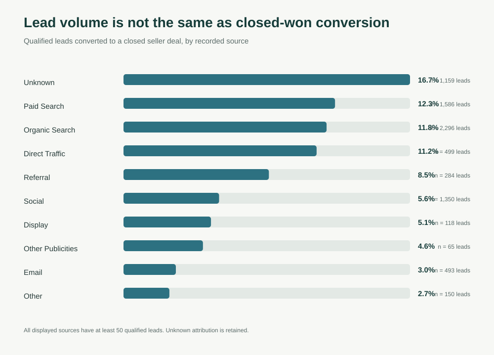
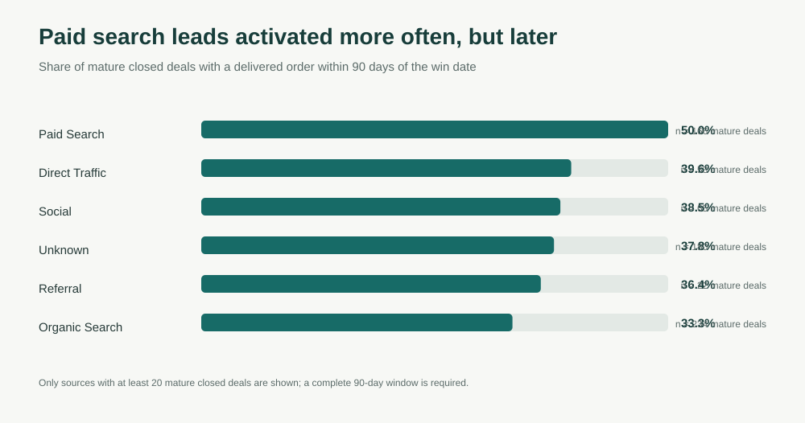
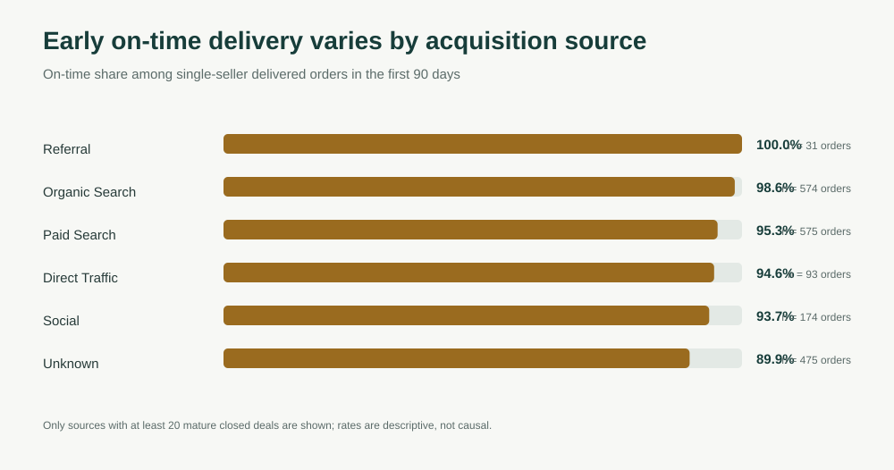

# From Lead to Reliable Seller

## The question

Which seller-acquisition sources do more than fill the pipeline? This case study connects Olist's marketing-qualified leads and closed deals to the sellers' first 90 days of marketplace orders. It asks whether lead volume and close rate are good enough measures of acquisition quality.

The analysis follows a seller through four stages:

**Qualified lead → closed deal → delivered order within 90 days → early delivery experience**

This is an independent portfolio analysis of anonymized historical data, not a claim about Olist's current performance.

## Executive summary

- **8,000** qualified leads produced **842** closed deals, a **10.5%** lead-to-won conversion rate.
- **746** closed sellers had a complete 90-day follow-up window. Of these, **290 (38.9%)** received at least one delivered order within 90 days of the win date.
- Paid search had a **50.0%** 90-day activation rate (**83/166** mature closed deals), compared with **33.3%** for organic search (**78/234**). However, paid-search sellers took a median **48 days** to reach their first delivered order, versus **38.5 days** for organic search.
- In the first 90 days, on-time delivery was **95.3% across 575 single-seller delivered orders** from paid-search sellers and **98.6% across 574 orders** from organic-search sellers. These are descriptive order outcomes; they do not show that acquisition source caused delivery performance.
- The source was unknown for **1,159 leads (14.5%)**. Those leads had the highest observed lead-to-won rate (**16.7%**), so incomplete attribution is a material measurement issue—not a channel to scale.

## What the analysis supports

The funnel tells a more useful story than lead volume alone. Paid search produced slightly more closed deals per qualified lead than organic search (**12.3% vs. 11.8%**) and a higher 90-day activation rate among mature closed deals. But activation was slower, and early on-time delivery was lower in the paid-search group. The channel comparison should trigger follow-up analysis, not an immediate budget shift.

### Qualified lead to closed deal



### Closed deal to 90-day seller activation



### Early delivery experience



## Recommended next actions

1. **Add 90-day seller activation to the acquisition scorecard.** Keep lead-to-won conversion as an early funnel measure, but do not treat it as the final measure of acquisition quality.
2. **Repair source attribution before reallocating spend.** More than one in seven qualified leads has an unknown source, and the unknown group converts unusually well. Audit tracking and CRM source capture before comparing channel economics.
3. **Investigate the paid-search activation path.** Its mature cohort activated more often but took longer to reach a first delivered order. Review lead mix, onboarding steps, product readiness, and time-to-first-listing.
4. **Check fulfillment by seller and region before changing acquisition policy.** Early on-time rates vary by source, but seller mix, geography, and logistics can explain those differences.
5. **Obtain campaign costs and seller contribution margin before calculating ROI.** This dataset does not include channel spend, support cost, or seller profitability, so it cannot support a return-on-ad-spend claim.

## Definitions and method

| Measure | Definition |
| --- | --- |
| Lead-to-won conversion | Distinct closed-deal MQLs divided by qualified MQLs, grouped by recorded lead origin. |
| Mature closed deal | A closed deal with a linked seller and a win timestamp no later than 90 days before the latest observed customer-delivery timestamp. |
| 90-day activated seller | A mature closed seller with at least one order purchased on or after `won_date`, marked `delivered`, and delivered within 90 days of `won_date`. |
| Time to first delivered order | Days from `won_date` to the customer-delivery timestamp of the first qualifying delivered order. |
| Early on-time rate | Share of delivered orders with one distinct seller where customer delivery occurred on or before the estimated date, within the seller's first 90 days after `won_date`. |
| Early review score | Mean order-level review score for those same single-seller orders. Multiple reviews on an order are averaged before the order is counted. |

The lead, deal, seller, order, order-item, and review tables are joined at their appropriate grains. Order-item rows are not treated as orders. Fulfillment results exclude multi-seller orders so one shared delivery outcome is not assigned to several sellers.

The order data ends on **October 17, 2018**. Wins after **July 19, 2018** do not have a full 90-day observation window and are excluded from the activation denominator. The resulting mature cohort is 746 of 842 closed deals. Source groups with fewer than 20 mature deals are omitted from the comparison charts; all source rows remain in the CSV output.

## Limitations

- This is anonymized historical data from 2016–2018; it is not representative of a current marketplace or current advertising mix.
- Lead origin is observational. Channel mix, seller characteristics, geography, and sales handling may differ, so the observed channel gaps are not causal effects.
- No advertising spend, lead cost, seller acquisition cost, or contribution margin is supplied. ROI and budget payback cannot be calculated.
- Delivery is observed at order level. The on-time comparison is limited to single-seller orders, but carrier and regional factors can still influence delivery.
- The lead source is missing or recorded as unknown for 14.5% of MQLs.
- The dataset is a public sample and some fields are anonymized; small source groups are especially uncertain.

## Reproduce

1. Download the two public Olist datasets linked in [`data/README.md`](data/README.md).
2. Put the five required CSV files together in a local `data/raw/` folder. Do not commit the raw files.
3. Run:

```bash
python src/analyze.py --data-dir data/raw
```

The script uses Python's standard library and SQLite. It validates key grains and lead-to-deal joins, runs the documented SQL views, and writes:

- `outputs/source_performance.csv`
- `outputs/early_fulfillment_quality.csv`
- the three SVG charts shown above

Run the helper tests with:

```bash
python -m unittest discover -s tests
```

## Repository map

- `sql/schema.sql` — source-table schema and indexes
- `sql/analysis.sql` — funnel, maturity, activation, and early fulfillment logic
- `src/analyze.py` — CSV loading, validation, summary generation, and SVG charts
- `outputs/` — aggregated results only; no raw customer or seller records
- `assets/` — charts generated from the analysis
- `tests/` — standard-library tests for core calculation helpers

## Sources

- Olist, [Brazilian E-Commerce Public Dataset](https://www.kaggle.com/datasets/olistbr/brazilian-ecommerce)
- Olist, [Marketing Funnel Dataset](https://www.kaggle.com/datasets/olistbr/marketing-funnel-olist)

The source datasets are anonymized and licensed by their publishers. See [`data/README.md`](data/README.md) for attribution and license notes.